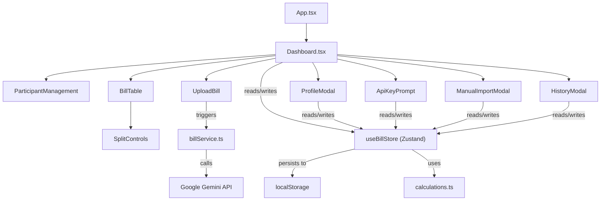
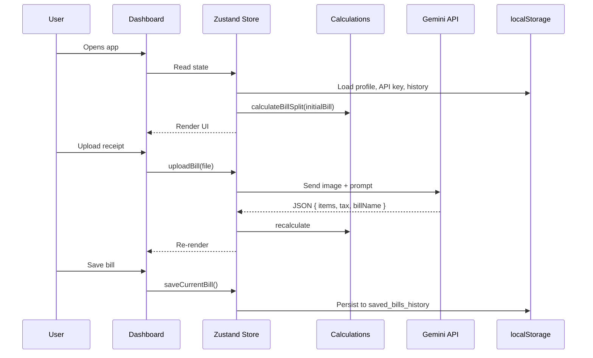

# Bill Splitter Pro — System Design

## 1. Architecture Overview

Bill Splitter Pro follows a **client-only SPA architecture** with no backend. All logic, state, and persistence run in the browser/WebView, wrapped in a Capacitor shell for Android deployment.

```
┌───────────────────────────────────────────────┐
│                Android APK                     │
│  ┌──────────────────────────────────────────┐  │
│  │           Capacitor WebView              │  │
│  │  ┌─────────────────────────────────────┐ │  │
│  │  │         React 19 SPA               │ │  │
│  │  │                                     │ │  │
│  │  │  ┌──────────┐   ┌───────────────┐  │ │  │
│  │  │  │ Zustand   │   │  Components   │  │ │  │
│  │  │  │ Store     │◄──┤  (9 .tsx)     │  │ │  │
│  │  │  └────┬──┬──┘   └───────────────┘  │ │  │
│  │  │       │  │                          │ │  │
│  │  │  ┌────▼─ ┼──────────┐              │ │  │
│  │  │  │localStorage      │              │ │  │
│  │  │  │ • user_profile   │              │ │  │
│  │  │  │ • user_api_key   │              │ │  │
│  │  │  │ • upi_config     │              │ │  │
│  │  │  │ • bill_history   │              │ │  │
│  │  │  └──────────────────┘              │ │  │
│  │  │       │                             │ │  │
│  │  │  ┌────▼──────────┐                  │ │  │
│  │  │  │ Gemini API     │ (external)      │ │  │
│  │  │  │ Receipt Scan   │                 │ │  │
│  │  │  └───────────────┘                  │ │  │
│  │  └─────────────────────────────────────┘ │  │
│  │                                           │  │
│  │  Native Plugins: Camera, Haptics, Share,  │  │
│  │  StatusBar, Keyboard, Filesystem          │  │
│  └──────────────────────────────────────────┘  │
└───────────────────────────────────────────────┘
```

---

## 2. Component Architecture



### Component Responsibilities

| Component | Role |
|---|---|
| `Dashboard.tsx` | Main layout, orchestrates all sub-components, conditional rendering of import buttons |
| `ParticipantManagement.tsx` | Add/remove participants |
| `BillTable.tsx` | Editable table of items with per-participant split controls |
| `SplitControls.tsx` | EQUAL/UNIT toggle and consumption checkboxes/inputs per item |
| `UploadBill.tsx` | Camera/gallery/drag-drop upload, triggers AI analysis |
| `ProfileModal.tsx` | User name, import preference, API key, UPI config |
| `ApiKeyPrompt.tsx` | Focused mini-modal: enter API key or switch to JSON |
| `ManualImportModal.tsx` | Two-step JSON import (copy prompt → paste response) |
| `HistoryModal.tsx` | View, load, delete saved bills |

---

## 3. State Management

A single **Zustand** store (`useBillStore.ts`) manages all application state. No context providers, no prop drilling for shared state.

### State Shape

```typescript
interface BillStoreState {
    // Active Bill
    bill: BillState;            // participants, items, tax, discount, billName
    splitResults: Record<string, number>;  // participantId → total
    isValid: boolean;

    // Profile
    userProfile: UserProfile;   // { name, importPreference }
    isProfileSetup: boolean;

    // AI Upload
    isUploading: boolean;
    uploadError: string | null;
    userApiKey: string | null;

    // UPI
    isUpiEnabled: boolean;
    upiId: string;
    upiName: string;

    // History
    savedBills: SavedBill[];
}
```

### Persistence Strategy

All user data is persisted to `localStorage` via a `safeStorage` abstraction that handles SSR/test environments:

| Key | Data |
|---|---|
| `user_profile` | `{ name, importPreference }` as JSON |
| `user_gemini_api_key` | API key string |
| `user_upi_enabled` | `"true"` / `"false"` |
| `user_upi_id` | UPI ID string |
| `user_upi_name` | Payee name string |
| `saved_bills_history` | Array of `SavedBill` as JSON |

---

## 4. Calculation Engine

Located in `calculations.ts`, the engine computes splits in real time:

### Algorithm

```
For each item:
  if EQUAL → price ÷ selectedParticipantCount
  if UNIT  → (participantUnits ÷ totalUnits) × price

subtotal = Σ item prices
participantSubtotal = Σ participant's item shares

Proportional Tax  = participantSubtotal × (tax ÷ subtotal)
Proportional Disc = participantSubtotal × (discount ÷ subtotal)

Final = participantSubtotal + proportionalTax - proportionalDiscount
```

### Validation

- EQUAL items must have ≥ 1 participant selected
- UNIT items must have total units > 0
- Invalid items flagged via `isValid` state

---

## 5. AI Integration

### Flow

```
User uploads image
  → UploadBill checks for API key
    → If missing: show ApiKeyPrompt (focused)
    → If present: call billService.uploadBillService()
      → Convert image to base64
      → Send to Gemini with structured prompt
      → Parse JSON response → { items[], tax, billName }
      → Merge into store (add items, set tax/name)
```

### Prompt Engineering

The prompt in `billService.ts` handles:
- Columnar receipt layouts (item on line 1, qty/price on line 2)
- Multi-line item names
- Quantity extraction (`2 x Naan`, or detached numbers)
- Tax aggregation (CGST + SGST + service charge)
- Strict JSON output format

---

## 6. Data Flow Diagram



---

## 7. Security Considerations

| Concern | Mitigation |
|---|---|
| API key exposure | Stored in localStorage, never sent to any server other than Google's Gemini API |
| Data privacy | All bill data stays on-device, zero telemetry |
| Input validation | JSON import validates structure before applying, calculation engine validates items |
| XSS | React's default JSX escaping; no `dangerouslySetInnerHTML` usage |
